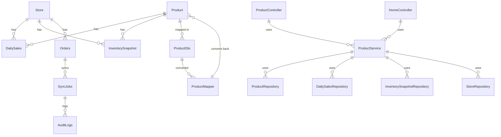

# 项目架构说明（多店铺看板）

本文档说明代码仓库中的分层架构、从前端到后端的调用流程，并附带一个 Mermaid 架构图（可在 VS Code 中用插件预览）。

## 整体架构

---
config:
  layout: dagre
---
flowchart TB
 subgraph s1["前端层"]
        UI["Dashboard UI - Thymeleaf"]
  end
 subgraph s2["后端服务层"]
        API["REST API Controller"]
        SVC["Service Layer"]
        MAP["Mapper Layer"]
        DTO["DTO Objects"]
  end
 subgraph s3["数据访问层"]
        REPO["Repository Layer"]
  end
 subgraph s4["数据存储层"]
        DB[("PostgreSQL")]
  end
 subgraph s5["定时任务层"]
        SCHED["Scheduler - Daily Sales Aggregation"]
  end
 subgraph s6["外部平台"]
        P1["抖音 API"]
        P2["拼多多 API"]
  end
    UI -- HTTP Requests --> API
    API -- calls --> SVC
    SVC -- maps --> MAP
    MAP -- converts --> DTO
    SVC -- persistence --> REPO
    REPO -- queries --> DB
    SCHED -- aggregates data from --> DB
    SCHED -- fetches data from --> P1 & P2

## 类图

```mermaid
classDiagram
    class Product {
        <<Entity>>
        -Long id
        -String internalSku
        -String productName
        -Integer douyinStock
        -Integer pddStock
        -Integer totalSales
        +getId() Long
        +setId(Long id) void
        +getInternalSku() String
        +setInternalSku(String internalSku) void
        +getProductName() String
        +setProductName(String productName) void
        +getDouyinStock() Integer
        +setDouyinStock(Integer douyinStock) void
        +getPddStock() Integer
        +setPddStock(Integer pddStock) void
        +getTotalSales() Integer
        +setTotalSales(Integer totalSales) void
    }

    class DailySales {
        <<Entity>>
        -Long id
        -Long productId
        -Integer storeId
        -LocalDate date
        -Integer soldQty
        -BigDecimal soldAmount
        -LocalDateTime createdAt
        +getId() Long
        +setId(Long id) void
        +getProductId() Long
        +setProductId(Long productId) void
        +getStoreId() Integer
        +setStoreId(Integer storeId) void
        +getDate() LocalDate
        +setDate(LocalDate date) void
        +getSoldQty() Integer
        +setSoldQty(Integer soldQty) void
        +getSoldAmount() BigDecimal
        +setSoldAmount(BigDecimal soldAmount) void
        +getCreatedAt() LocalDateTime
        +setCreatedAt(LocalDateTime createdAt) void
    }

    class InventorySnapshot {
        <<Entity>>
        -Long id
        -Long productId
        -Integer storeId
        -String sku
        -Integer quantity
        -LocalDateTime snapshotTime
        -LocalDateTime createdAt
        +getId() Long
        +setId(Long id) void
        +getProductId() Long
        +setProductId(Long productId) void
        +getStoreId() Integer
        +setStoreId(Integer storeId) void
        +getSku() String
        +setSku(String sku) void
        +getQuantity() Integer
        +setQuantity(Integer quantity) void
        +getSnapshotTime() LocalDateTime
        +setSnapshotTime(LocalDateTime snapshotTime) void
        +getCreatedAt() LocalDateTime
        +setCreatedAt(LocalDateTime createdAt) void
    }

    class Store {
        <<Entity>>
        -Long id
        -String platform
        -String platformStoreId
        -String name
        -String credentialsRef
        -Boolean enabled
        +getId() Long
        +setId(Long id) void
        +getPlatform() String
        +setPlatform(String platform) void
        +getPlatformStoreId() String
        +setPlatformStoreId(String platformStoreId) void
        +getName() String
        +setName(String name) void
        +getCredentialsRef() String
        +setCredentialsRef(String credentialsRef) void
        +getEnabled() Boolean
        +setEnabled(Boolean enabled) void
    }

    class Orders {
        <<Entity>>
        -Long id
        -String platformOrderId
        -Long storeId
        -Long productId
        -String sku
        -Integer qty
        -BigDecimal amount
        -String status
        -LocalDateTime createdAt
        -String rawPayload
        +getId() Long
        +setId(Long id) void
        +getPlatformOrderId() String
        +setPlatformOrderId(String platformOrderId) void
        +getStoreId() Long
        +setStoreId(Long storeId) void
        +getProductId() Long
        +setProductId(Long productId) void
        +getSku() String
        +setSku(String sku) void
        +getQty() Integer
        +setQty(Integer qty) void
        +getAmount() BigDecimal
        +setAmount(BigDecimal amount) void
        +getStatus() String
        +setStatus(String status) void
        +getCreatedAt() LocalDateTime
        +setCreatedAt(LocalDateTime createdAt) void
        +getRawPayload() String
        +setRawPayload(String rawPayload) void
    }

    class SyncJobs {
        <<Entity>>
        -Long id
        -String jobType
        -Long storeId
        -String status
        -LocalDateTime startedAt
        -LocalDateTime finishedAt
        -Map meta
        -LocalDateTime createdAt
        +getId() Long
        +setId(Long id) void
        +getJobType() String
        +setJobType(String jobType) void
        +getStoreId() Long
        +setStoreId(Long storeId) void
        +getStatus() String
        +setStatus(String status) void
        +getStartedAt() LocalDateTime
        +setStartedAt(LocalDateTime startedAt) void
        +getFinishedAt() LocalDateTime
        +setFinishedAt(LocalDateTime finishedAt) void
        +getMeta() Map
        +setMeta(Map meta) void
        +getCreatedAt() LocalDateTime
        +setCreatedAt(LocalDateTime createdAt) void
    }

    class AuditLogs {
        <<Entity>>
        -Long id
        -String actor
        -String action
        -String resourceType
        -Long resourceId
        -String request
        -String response
        -LocalDateTime createdAt
        +getId() Long
        +setId(Long id) void
        +getActor() String
        +setActor(String actor) void
        +getAction() String
        +setAction(String action) void
        +getResourceType() String
        +setResourceType(String resourceType) void
        +getResourceId() Long
        +setResourceId(Long resourceId) void
        +getRequest() String
        +setRequest(String request) void
        +getResponse() String
        +setResponse(String response) void
        +getCreatedAt() LocalDateTime
        +setCreatedAt(LocalDateTime createdAt) void
    }

    class ProductDto {
        <<DTO>>
        -Long id
        -String internalSku
        -String productName
        -Integer douyinStock
        -Integer pddStock
        -Integer totalSales
        +getId() Long
        +setId(Long id) void
        +getInternalSku() String
        +setInternalSku(String internalSku) void
        +getProductName() String
        +setProductName(String productName) void
        +getDouyinStock() Integer
        +setDouyinStock(Integer douyinStock) void
        +getPddStock() Integer
        +setPddStock(Integer pddStock) void
        +getTotalSales() Integer
        +setTotalSales(Integer totalSales) void
    }

    class ProductController {
        <<Controller>>
        -ProductService productService
        +list() List~ProductDto~
        +add(ProductDto productDto) ProductDto
        +updateStock(Long id, Integer douyin, Integer pdd) void
    }

    class HomeController {
        <<Controller>>
        -ProductService productService
        +index(Model model) String
    }

    class ProductService {
        <<Service>>
        -ProductRepository productRepo
        +getAllProducts() List~ProductDto~
        +addProduct(ProductDto productDto) ProductDto
        +updateStock(Long id, Integer douyinStock, Integer pddStock) void
    }

    class ProductMapper {
        <<Mapper>>
        +toEntity(ProductDto dto) Product
        +toDto(Product p) ProductDto
    }

    class ProductRepository {
        <<Repository>>
        +findAll() List~Product~
        +findById(Long id) Optional~Product~
        +save(Product product) Product
        +findByInternalSku(String internalSku) List~Product~
        +findByProductNameContaining(String productName) List~Product~
    }

    class DailySalesRepository {
        <<Repository>>
        +findByProductIdAndDateBetween(Long productId, LocalDate startDate, LocalDate endDate) List~DailySales~
        +findByDate(LocalDate date) List~DailySales~
        +findByStoreIdAndDate(Long storeId, LocalDate date) List~DailySales~
    }

    class InventorySnapshotRepository {
        <<Repository>>
        +findByProductIdAndSnapshotTimeBetween(Long productId, LocalDateTime startTime, LocalDateTime endTime) List~InventorySnapshot~
        +findByStoreId(Long storeId) List~InventorySnapshot~
        +findBySku(String sku) List~InventorySnapshot~
    }

    class StoreRepository {
        <<Repository>>
        +findByEnabledTrue() List~Store~
        +findByPlatform(String platform) List~Store~
        +findByPlatformAndPlatformStoreId(String platform, String platformStoreId) Store
    }
```

## 实体关系图

## 分层说明

### 前端层
- **Dashboard UI**: 使用Thymeleaf模板引擎构建的前端页面，展示商品列表和库存信息

### 后端服务层
- **REST API Controller**: 处理HTTP请求，包括产品管理API和主页展示
- **Service Layer**: 业务逻辑处理层，处理产品管理、库存更新等业务
- **Mapper Layer**: DTO与Entity之间的转换层
- **DTO Objects**: 数据传输对象，用于API间的数据传输

### 数据访问层
- **Repository Layer**: 数据访问层，使用Spring Data JPA与数据库交互

### 数据存储层
- **PostgreSQL**: 主要数据存储，包含产品、销售、库存等信息

### 定时任务层
- **Scheduler**: 负责每日销售数据聚合的定时任务
- **数据聚合**: 将各平台销售数据聚合为每日销售汇总

### 外部平台
- **抖音 API**: 用于获取订单和库存数据
- **拼多多 API**: 用于获取订单和库存数据

## Sprint 1 核心数据模型

在Sprint 1中，我们实现了以下核心数据模型：
- **Product**: 商品基本信息（SKU、名称、各平台库存）
- **DailySales**: 每日销售汇总数据
- **InventorySnapshot**: 库存快照
- **Store**: 店铺信息
- **Orders**: 订单数据
- **SyncJobs**: 同步任务
- **AuditLogs**: 审计日志

这些模型为后续的业务功能实现奠定了基础。